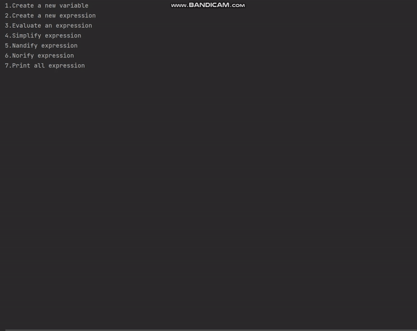
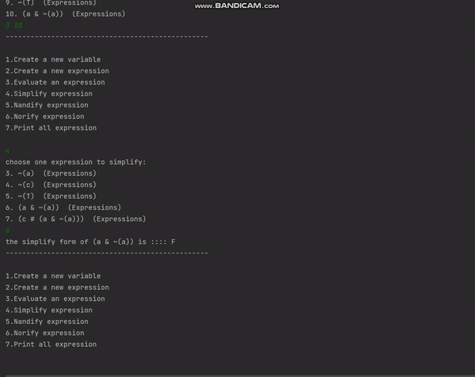

# Logical-Expression-Interpreter

<h4>Project in java that implement's alot of OOP principles from my 'Object Oriented Programming' Course.</h4>

<h5>This program can be used to:</h5>

<ul>
<li>Creating  logic variables and expression.</li>
<li>Evalute expressions.</li>
<li>Get expression variables, and assigned them with values.</li>
<li>Simplfy/Norify/Nandify an expression.</li>
</ul>

<h5>The program follows the following hierarchy:</h5>

<h2>How To Use?</h2>

<h2>How To Run? </h2>

Download the source code to your computer and open the src file in your IDE, re-build the project and press 'F5' (run) 

